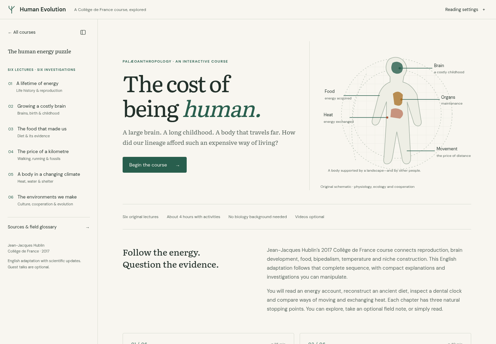

# Interactive courses

A collection of interactive textbooks. The [course index](site/index.html) links to:

| Course | Source | Published path |
| --- | --- | --- |
| The Cosmos, Computed | `courses/astrophysics/` | `/astrophysics/` |
| The Calculus of Inductive Constructions | `courses/cic/` | `/cic/` |
| Proofs Are Programs *(in progress)* | `courses/proofs-are-programs/` | `/proofs-are-programs/` |
| SSA to Silicon | `courses/compiler-backends/` | `/compiler-backends/` |
| Language Models from Scratch *(in progress)* | `courses/language-models/` | `/language-models/` |
| Incompleteness and Computability *(in progress)* | `courses/incompleteness/` | `/incompleteness/` |
| Euclid’s Elements: an interactive edition | `courses/elements/` | `/elements/` |
| Proofcraft: learning to prove, one great theorem at a time | `courses/proofs/` | `/proofs/` |
| Digital Circuits | `courses/digital-circuits/` | `/digital-circuits/` |
| Particle Physics *(in progress)* | `courses/particle-physics/` | `/particle-physics/` |
| Mandarin, Out Loud | `courses/mandarin/` | `/mandarin/` |
| Human Evolution | `courses/human-evolution/` | `/human-evolution/` |
| For All Inputs: formal verification from SAT solvers to verified systems | `courses/formal-verification/` | `/formal-verification/` |
| Memory Management | `courses/memory-management/` | `/memory-management/` |

Every course has an “All courses” link beside its contents and a compact contents toggle in its own header or drawer handle. Sidebars collapse on desktop and open as drawers on smaller screens; each course remembers its desktop preference. The shared navigation lives in `packages/course-navigation/`.

## Build

Node.js 22 or later is required. Each course keeps its own dependencies and lockfile; language-models is a pnpm workspace (its site, its TypeScript library and a Python training lab), so it also needs [pnpm](https://pnpm.io).

```sh
npm ci --prefix courses/astrophysics
npm ci --prefix courses/cic
npm ci --prefix courses/proofs-are-programs
npm ci --prefix courses/compiler-backends
npm ci --prefix courses/incompleteness
npm ci --prefix courses/elements
npm ci --prefix courses/proofs
npm ci --prefix courses/digital-circuits
npm ci --prefix courses/particle-physics
npm ci --prefix courses/mandarin
npm ci --prefix courses/human-evolution
npm ci --prefix courses/formal-verification
npm ci --prefix courses/memory-management
pnpm --dir courses/language-models install --frozen-lockfile
npm run build
```

The build creates `dist/index.html` and the fourteen course directories in `dist/`. The CIC course and Proofs Are Programs share their language implementation, `packages/kernel/`. For a local preview, serve `dist/` as the web root, for example with `python3 -m http.server 8000 -d dist`.

On GitHub Actions, the build derives the Pages project path from `GITHUB_REPOSITORY`. If hosting under a different path, set `COURSES_BASE_PATH` to that path (or to an empty string for a domain root). Relative links on the index and the two Vite courses adapt automatically; Astro uses this value for astrophysics links and assets, and the build passes `<base>/<course>` to each SvelteKit course as `BASE_PATH`.

Pushes that touch `courses/language-models/` also run its tests, type checks and Python lab checks (`.github/workflows/language-models.yml`); pushes that touch `courses/incompleteness/` run its conversion check, type check and tests (`.github/workflows/incompleteness.yml`); pushes that touch `courses/proofs/` run its tests, type checks and build (`.github/workflows/proofs.yml`); pushes that touch `courses/elements/` run its conversion check, type check and tests (`.github/workflows/elements.yml`); pushes that touch `courses/digital-circuits/` run its tests, type check and build (`.github/workflows/digital-circuits.yml`); pushes that touch `courses/particle-physics/` do the same (`.github/workflows/particle-physics.yml`), so do pushes that touch `courses/mandarin/` (`.github/workflows/mandarin.yml`), so do pushes that touch `courses/formal-verification/` (`.github/workflows/formal-verification.yml`), and so do pushes that touch `courses/memory-management/` (`.github/workflows/memory-management.yml`).
Human Evolution runs its model/content tests, type check, prefixed build and browser learning/navigation checks (`.github/workflows/human-evolution.yml`).
Pushes that touch `packages/kernel/` (the language shared by the CIC course and Proofs Are Programs) run the checks of both courses (`.github/workflows/cic.yml` and `.github/workflows/proofs-are-programs.yml`).

To install, build and preview everything locally in one step, run `npm run preview` (serves `dist/` at <http://localhost:8000>). It accepts `--skip-install`, `--skip-build` and `--port <n>`, for example `npm run preview -- --skip-install --port 3000`. If pnpm isn't installed, it runs the version pinned by language-models through `npx`.

Course-specific development and tests are documented in each course's README.

## Human Evolution

The complete six-lecture Collège de France adaptation follows life history, childhood, diet, movement, temperature and niche construction, with focused models, scientific updates and optional timestamped source links. [Course documentation and current screenshots](courses/human-evolution/README.md).



## Content checks

After building, run `npm run audit` (requires Python 3) to check every generated HTML page for broken local links and images, missing section targets, duplicate IDs and equation errors. For a build published under a prefix, use `npm run audit -- --base-path /courses`, replacing `/courses` with the value used for `COURSES_BASE_PATH`. Hash-router destinations, widget behavior and mobile layout also need browser checks. With the built site served locally, `python3 scripts/check-course-navigation.py http://127.0.0.1:8000` checks collection links, remembered sidebar collapse, mobile drawers and keyboard focus across every course (requires Python Playwright and Chromium).
