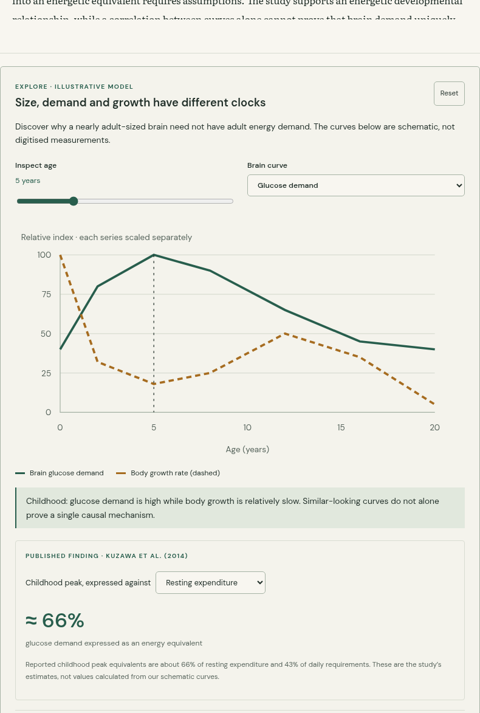
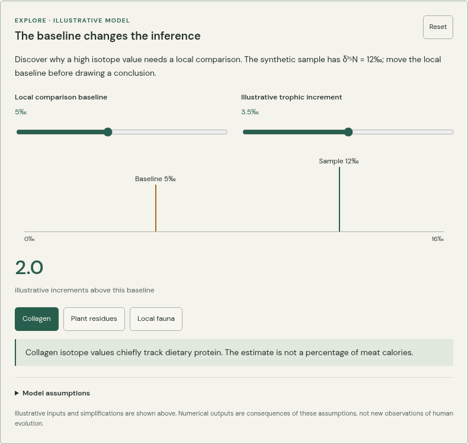
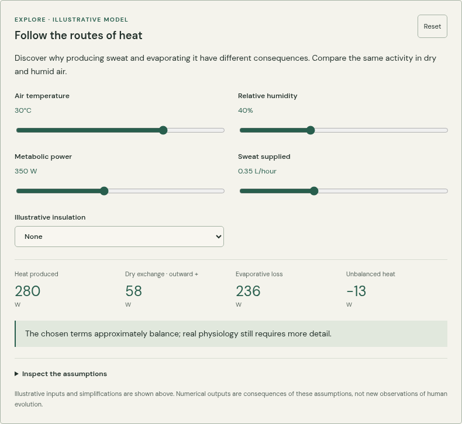
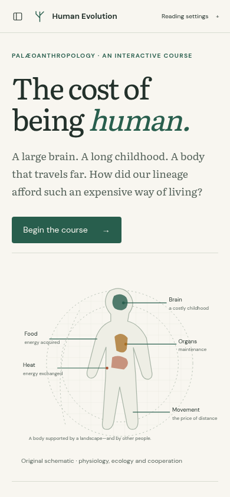
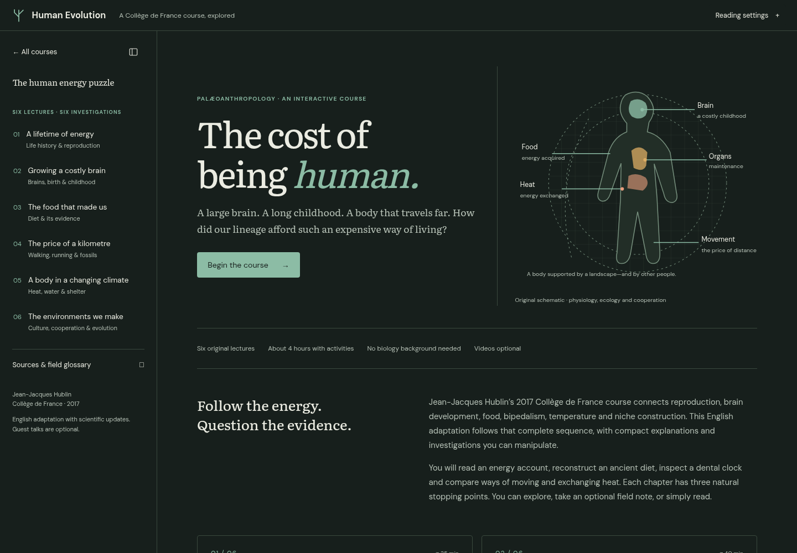

# Human Evolution

**Energy, childhood, and the environments we make.** A compact interactive adaptation of all six of Jean-Jacques Hublin’s 2017 Collège de France lectures, in their original order. About 9,700 words, six chapters with three reading sessions each, eleven focused figures and ten checked questions. Allow roughly four hours with activities; viewing the original nine-hour lecture series is optional.


## Current progress — 4 October 2026

The complete six-lecture text and application are implemented. The reader, model controls, source preferences and screenshots have been exercised in Chromium; type checks and the static build pass. The remaining implementation work is collection integration, broader browser workflow checks, scientific provenance documentation and PR completion. Screenshots below are from the current working course, not mockups.

| Chapter | Coverage | Investigations |
| --- | --- | --- |
| A lifetime of energy | Ecology, organ costs, life histories, reproduction, transfers and longevity | Energy accounting; provisioning |
| Growing a costly brain | Scaling, throughput, development, birth constraints, teeth and juvenile fossils | Developmental clocks; dental formation |
| The food that made us | Dietary proxies, preservation, food acquisition, processing and fire | Isotope baselines; preparation returns |
| The price of a kilometre | Bipedal anatomy, movement costs, endurance and fossil diversity | Power versus distance; fossil evidence guide |
| A body in a changing climate | Heat exchange, water, hair, proportions, brown fat, shelter and clothing | Heat balance; body geometry |
| The environments we make | Landscapes, culture–gene feedback, cortical evidence and cooperation | Niche feedback; final evidence case |

The 2018 symposium is an optional source collection. Core insights are integrated into relevant explanations; there are no additional mandatory seminar chapters. The course includes later qualifications on menopause, neonatal brain proportions, Dmanisi, diet, fire-making, receptors, dairying and social-group extrapolation.

## Screenshots





<details>
<summary>Heat exchange, mobile reading and dark theme</summary>







</details>

## Run and check

Requires Node.js 22.12 or later. This is a single SvelteKit/Svelte package with a static adapter, a small Markdown renderer and original SVG figures. No backend, simulation workers or external media players are required.

```sh
npm ci
npm run dev
npm run check
npm test
npm run build
npm run test:browser
```

Browser checks use system Chromium when available. Otherwise run `npx playwright install chromium`; set `CHROMIUM_PATH` to select a different executable. `npm run screenshots` runs the browser checks and refreshes the six tracked screenshots. For a project deployment, build and check with the same prefix:

```sh
BASE_PATH=/courses/human-evolution npm run build
BASE_PATH=/courses/human-evolution npm run test:browser
```

The collection build supplies this path automatically. Locally, the standalone course runs at `/`; its All courses link is intended for the collection deployment.

## Sources and authoring

[Plan](docs/PLAN.md) · [Scientific updates](docs/SCIENTIFIC-UPDATES.md) · [Research and transcript provenance](research/README.md). Raw captions remain in the repository’s research ZIP and are excluded from site assets. Original French titles and optional timestamped links connect the new English prose to the lectures.

All numerical figures declare illustrative inputs and model limits at the figure. The childhood plot is schematic; the published peak equivalents are identified separately. Changing the video preference preserves drafts and reading position. Notes stay on the device, can be downloaded, and are self-reviewed rather than automatically graded. Editing a reviewed note clears its self-review status; changing a multiple-choice selection invalidates its checked feedback.

The fonts are bundled locally under their SIL Open Font Licenses. Source papers, lecture recordings and captions retain their respective rights; no third-party photographs or media are redistributed.
